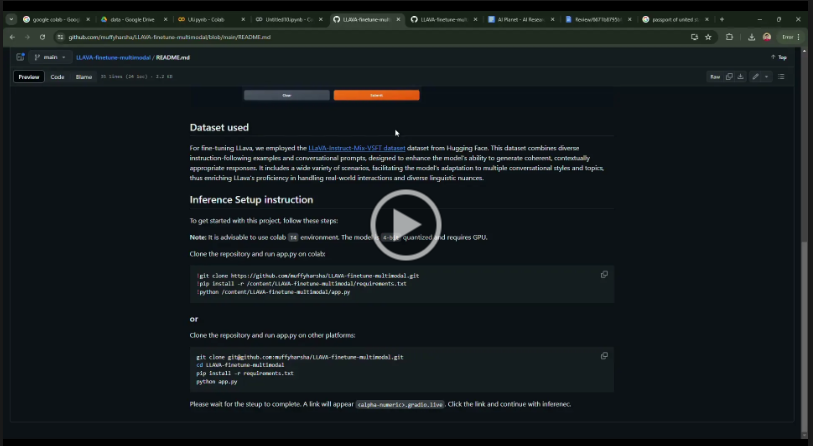

# LLAVA mulimodal fine-tuning
Fine-tuning LLava, a leading-edge Large Language Model (LLM), enhances its capabilities for specific applications by adapting its general linguistic knowledge to specialized datasets. This process improves the model’s performance in handling domain-specific content, such as technical jargon or industry-specific terminology. By refining LLava’s pre-trained understanding, fine-tuning aligns the model more closely with unique requirements, making it adept at specialized tasks like customer support or medical documentation. This guide outlines key strategies for effectively fine-tuning LLava, ensuring optimal performance tailored to your application's needs.

This project uses ```gradio``` to serve the fine tuned model


[](https://drive.google.com/file/d/164KuH2qRzHLm7LFdbxZPDtqSzb1PAper/view?usp=sharing)


## Dataset used
For fine-tuning LLava, we employed the [LLaVA-Instruct-Mix-VSFT dataset](https://huggingface.co/datasets/HuggingFaceH4/llava-instruct-mix-vsft) dataset from Hugging Face. This dataset combines diverse instruction-following examples and conversational prompts, designed to enhance the model's ability to generate coherent, contextually appropriate responses. It includes a wide variety of scenarios, facilitating the model’s adaptation to multiple conversational styles and topics, thus enriching LLava’s proficiency in handling real-world interactions and diverse linguistic nuances.

## Inference Setup instruction
To get started with this project, follow these steps:

**Note:** It is advisable to use colab ```T4``` environment. The model is ```4-bit``` quantized and requires GPU. 


Clone the repository and run app.py on colab:

   ```bash
   !git clone https://github.com/muffyharsha/LLAVA-finetune-multimodal.git
   !pip install -r /content/LLAVA-finetune-multimodal/requirements.txt
   !python /content/LLAVA-finetune-multimodal/app.py
   ```

### or

Clone the repository and run app.py on other platforms:
   
   ```bash
   git clone git@github.com:muffyharsha/LLAVA-finetune-multimodal.git
   cd LLAVA-finetune-multimodal
   pip install -r requirements.txt
   python app.py
  ```

Please wait for the steup to complete. A link will appear ```<alpha-numeric>.gradio.live```. Click the link and continue with inferenec.
